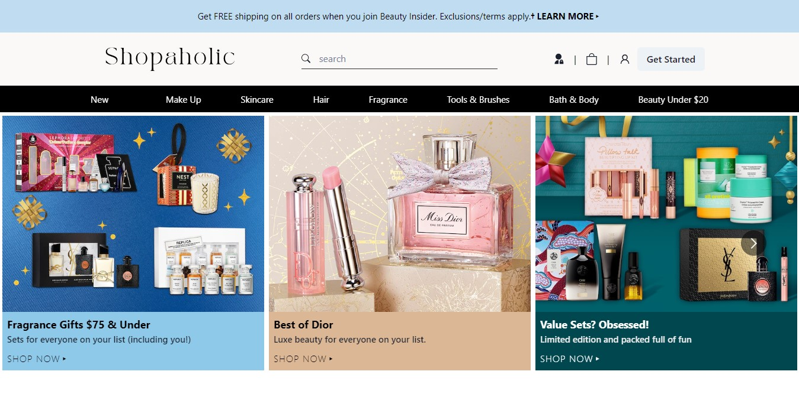
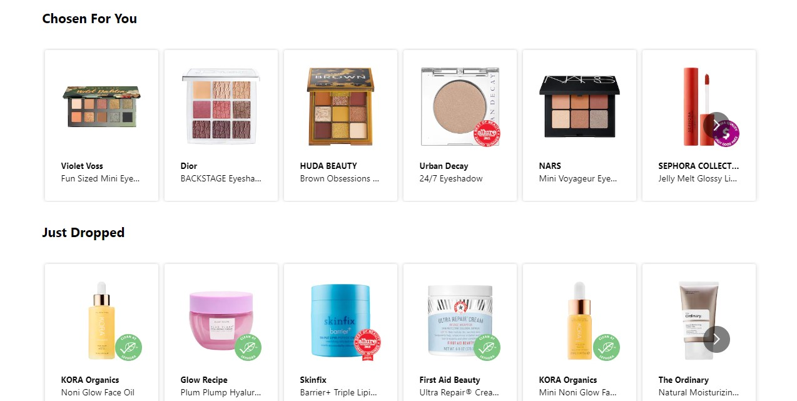
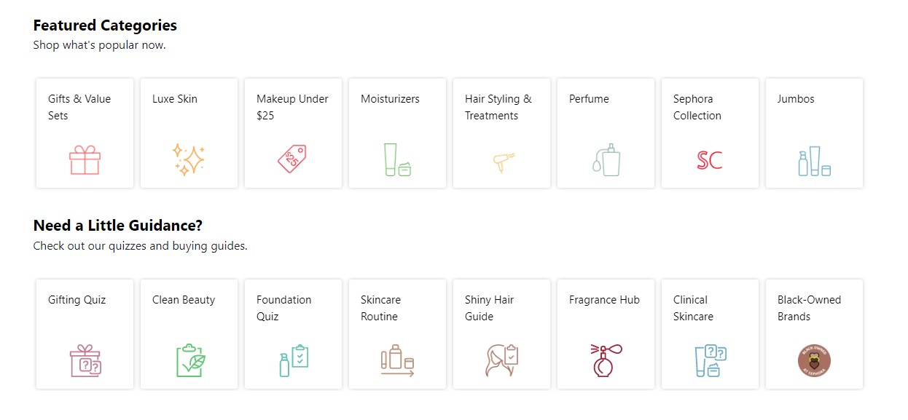
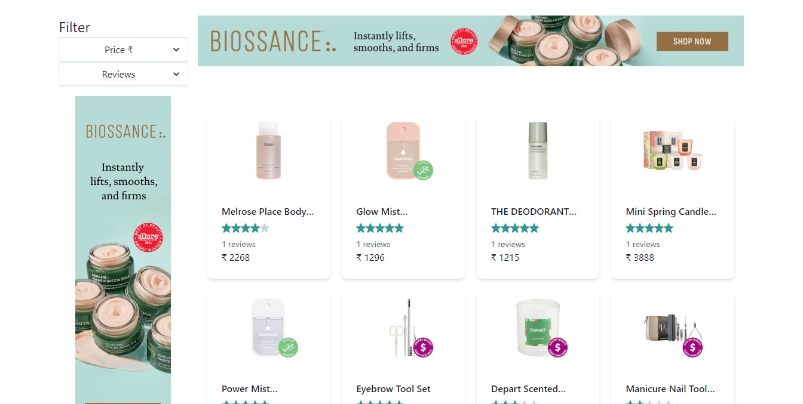
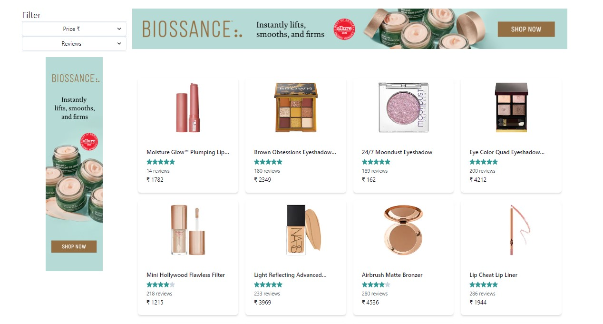
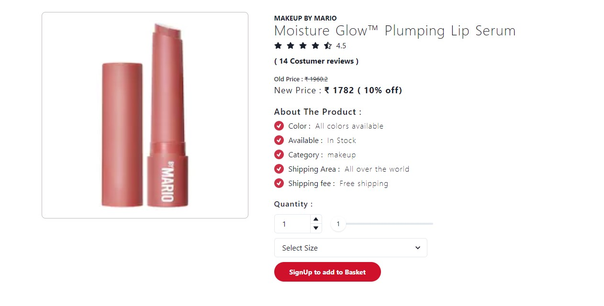
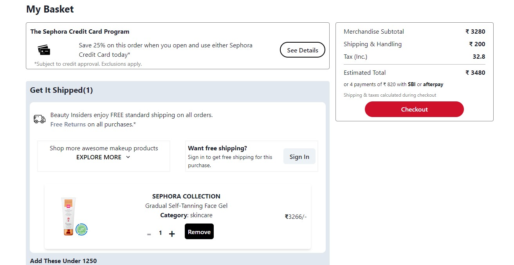
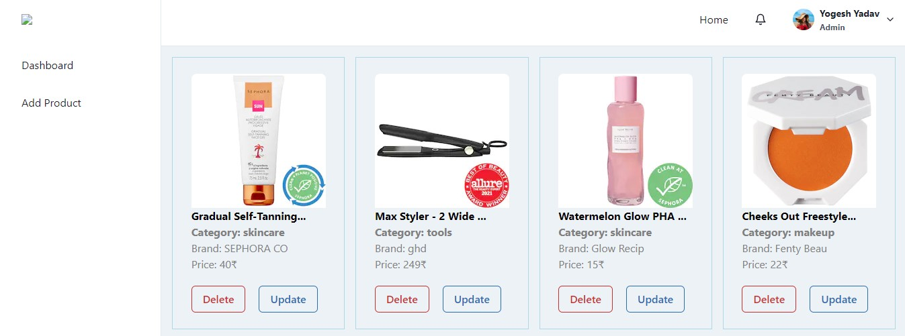
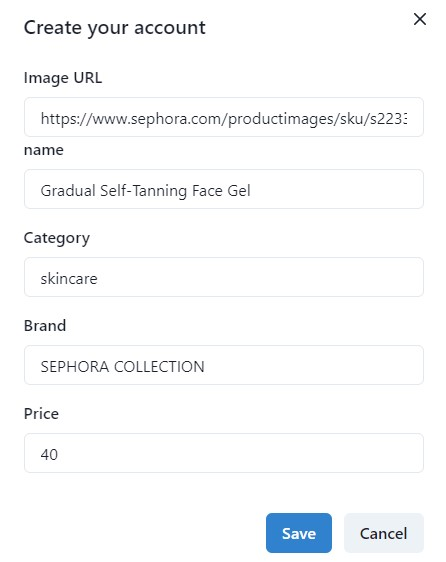
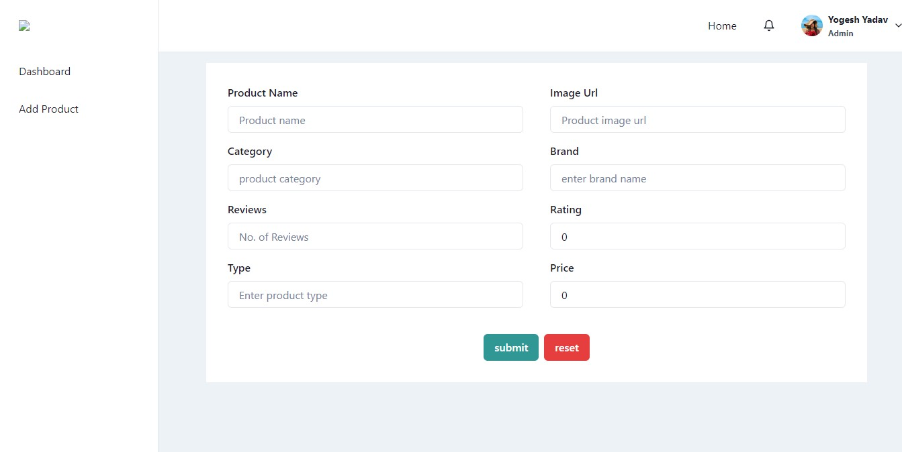

## Hello Everyone

This is our construct week project where we have cloned Sephora.com website. This is a collaborative project of team of 5 members and a duration of 5 days.We have renamed the website as "Shopaholic"

## About Website

It is an ecommerce website which deals in variety of beauty and care products for women.

## Tech Stacks

- React Js
- Node JS
- Express JS

## External libraries and frameworks

- Redux
- Chakra UI

## Features

- Responsive UI
- Login/signup functionality
- Filter functionality
- Add to cart functionality
- Rest Api's
- CRUD functionalitites for products

## Landing Page

## Product Pages

## Single Product Page

## Cart Page

## Admin Dashboard Page

## Update form

## Add new Product Page

